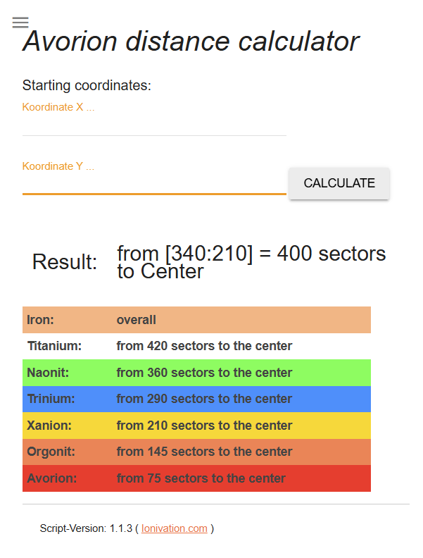

# AvorionDistanceCalculator

  

**HTML/CSS/JavaScript web application**  

JS und HTML basierte kleine Anwendung,
um die Entfernung zum Zentrum der Galaxie im Spiel Avorion zu berechnen.  
Dieser ist unter der Adresse <https://www.ionivation.com/avorion-entfernungsrechner/> im Einsatz.  

Nutzt jQuery und  Material Design Lite  

---

## Installation

> keine Installation nötig, einfach die [index.html](index.html) im Browser öffnen und loslegen.  

## Geplante zukünftige Features

- [ ] **Berechnung zwischen zwei individuellen Punkten auf der Karte**  
  - feature/route  
