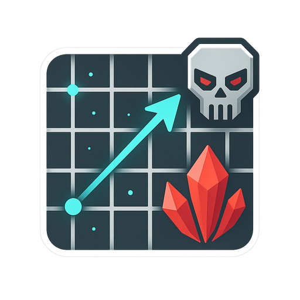

# **Avorion Distance Calculator 2.0**

  

## Inhalt

- [**Avorion Distance Calculator 2.0**](#avorion-distance-calculator-20)
  - [Inhalt](#inhalt)
  - [Was ist anders und was neu?](#was-ist-anders-und-was-neu)
  - [Installation](#installation)
    - [Linux](#linux)
    - [Windows](#windows)
    - [MAC](#mac)
  - [Geplante zukünftige Features](#geplante-zukünftige-features)

---

## Was ist anders und was neu?

---

**HTML/CSS/JavaScript web application**  

JS und HTML basierte kleine Anwendung,
um die Entfernung zum Zentrum der Galaxie im Spiel Avorion zu berechnen.  
Dieser ist unter der Adresse <https://www.ionivation.com/avorion-entfernungsrechner/> im Einsatz.  

Nutzt jQuery und  Material Design Lite  

---

## Installation

> **[PLATZHALTER]**  

### Linux

### Windows

### MAC

> - keine Ahnung, habe kein MAC aber wäre an Feedback interessiert!

---

## Geplante zukünftige Features

- [ ] **Berechnung zwischen zwei individuellen Punkten auf der Karte**  
  - feature/route  
